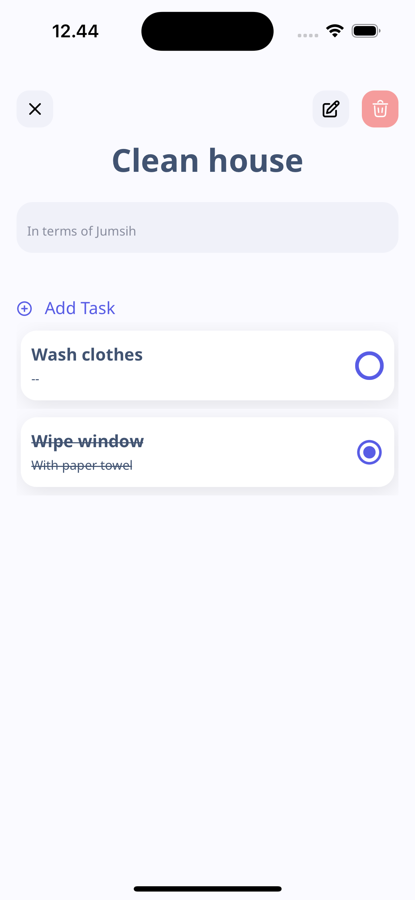

## Problem Solving Tests

This project includes several coding challenges and problem-solving exercises located in the `./problemSolving/` directory. Each file corresponds to a specific problem statement and contains the solution implemented in TypeScript.

### Structure

- **Problem Solving Directory**: `./problemSolving/`
  - `miniMaxSum.ts`: Implementation of the Mini-Max Sum test.
  - `plusMinus.ts`: Implementation of the Plus Minus test.
  - `timeConversion.ts`: Implementation of the Time Conversion test.

### Note to Reviewers

If you are reviewing my code, please check the individual files in the `./problemSolving/` directory for the solutions to the respective problems. Each solution is designed to demonstrate my understanding of algorithm design and TypeScript.

Feel free to run the tests and provide feedback on the implementations!

---

# To-Do List App

This is a **To-Do List App** built with **React Native**. It supports task and activity creation, completion tracking, and real-time synchronization using **Supabase**. The app is developed for **assessment purposes** and is not intended for public use.

## Table of Contents

- [Features](#features)
- [Technologies Used](#technologies-used)
- [Design System](#design-system)
- [Installation](#installation)
- [Usage](#usage)
- [Screenshots](#screenshots)
- [License](#license)

## Features

- Create, edit, delete tasks and activities.
- Link tasks to specific activities.
- Swipe-to-delete tasks.
- Track task completion with real-time updates.
- Dark and light theme support.
- Error handling and toast notifications for a smooth user experience.
- Integrated sorting rules to prioritize incomplete tasks and order by latest updates.

## Technologies Used

- **React Native**: Frontend framework for building native mobile applications using JavaScript.
- **Supabase**: Backend-as-a-service for database and authentication management.
- **IcoMoon** and **LineIcons**: Icon libraries for vector icons and illustrations.
- **React Native Gesture Handler** and **Reanimated**: Libraries for smooth gesture handling and animations.
- **Figma Design**: UI and Design system inspired by the OneLook Wellness App.

## Design System

The design system and UI components in this app are structured based on **Atomic Design principles**. Here’s a breakdown:

- **Atoms**: Buttons, text components, icons.
- **Molecules**: Container and content sections.
- **Organisms**: Task cards, headers, and complex UI elements.

### **Design References:**

- **Tooploox Team** & **Weronika Kołodziej-Teszbir** – "OneLook Wellness App" ([Figma File](https://www.figma.com/community/file/1192403827893885122/onelook-wellness-app)).
- **Icons**:
  - [IcoMoon Free](https://icomoon.io/app/#/select/library)
  - [LineIcons](http://designmodo.com/linecons-free/)

## Installation

To run this project locally, you will need **Node.js** and **React Native CLI** installed.

### Step 1: Clone the repository

```bash
git clone https://github.com/herujest/simple-todo.git
cd simple-todo
```

### Step 2: Install dependencies

```bash
npm install
```

### Step 3: Run the app

```bash
npx react-native run-android # for Android
npx react-native run-ios     # for iOS
```

## Usage

Once the app is running, you can:

- **Create a task or activity**: Use the "Add Task" button to create standalone tasks or activities with linked tasks.
- **Swipe to delete**: Swipe a task to the left to reveal a delete button and remove the task.
- **Complete tasks**: Tap on the radio button next to a task to mark it as complete or incomplete.
- **Edit tasks or activities**: Click on a task or activity to edit its details.
- **View completed tasks**: Completed tasks are moved to the bottom of the list, while incomplete tasks appear at the top.

## Screenshots

Here are some screenshots of the app:

### Welcome Screen


### About Page


### Add More Goal


### Add Task from Home


### Contact Page


### Delete Activity


### Swipe to delete task


### Detail Activity


### Edit Activity


### Empty Home


### Home with list task


### List Activity


### Mark Done Task from activity



### Create New Activity page 1


### Create New Activity page 2


### New Goal


### New Single Task


### Settings Page


## License

This project is for **assessment purposes only** and is not licensed for public or commercial use.
